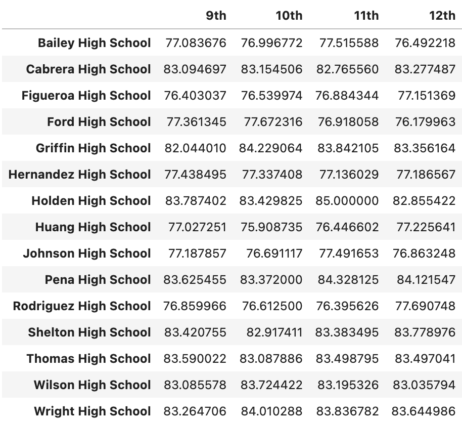
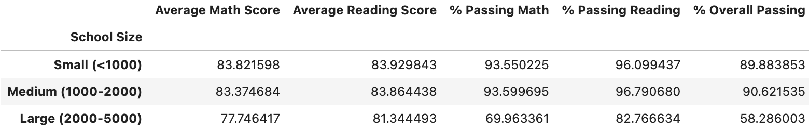

# Pyschool Pandas Challenge
## Introduction
In this assignment, I will create and manipulate Pandas DataFrames to analyze school and standardized test data.

Background
I am the new Chief Data Scientist for your city's school district. In this capacity, you'll be helping the school board and mayor make strategic decisions regarding future school budgets and priorities.

As a first task, I've been asked to analyze the district-wide standardized test results. I will be given access to every student's math and reading scores, as well as various information on the schools they attend. My task is to aggregate the data to showcase obvious trends in school performance.

## Before Beginning
Create a new repository for this project called pandas-challenge.

Clone the new repository to your computer.

Inside your local Git repository, create a folder for this homework assignment and name it PyCitySchools.

Add the Jupyter notebook to this folder. This will be the main script to run for analysis.

Push these changes to GitHub or GitLab.

## Files
Download the following files: schools_complete.csv and students_complete.csv

## Instructions
Using Pandas and Jupyter Notebook, create a report that includes the following data. Your report must include a written description of at least two observable trends based on the data.

Hint: Check out the sample solution called PyCitySchools_starter.ipynb located in the .zip file to review the desired format for this assignment.

District Summary
Perform the necessary calculations and then create a high-level snapshot of the district's key metrics in a DataFrame.

Include the following:

- Total number of unique schools
- Total students
- Total budget
- Average math score
- Average reading score
- % passing math (the percentage of students who passed math)
- % passing reading (the percentage of students who passed reading)
- % overall passing (the percentage of students who passed math AND reading)

### School Summary
Perform the necessary calculations and then create a DataFrame that summarizes key metrics about each school.

Include the following:

- School name
- School type
- Total students
- Total school budget
- Per student budget
- Average math score
- Average reading score
- % passing math (the percentage of students who passed math)
- % passing reading (the percentage of students who passed reading)
- % overall passing (the percentage of students who passed math AND reading)

### Highest-Performing Schools (by % Overall Passing)
Sort the schools by % Overall Passing in descending order and display the top 5 rows.

Save the results in a DataFrame called "top_schools".

### Lowest-Performing Schools (by % Overall Passing)
Sort the schools by % Overall Passing in ascending order and display the top 5 rows.

Save the results in a DataFrame called "bottom_schools".

### Math Scores by Grade
Perform the necessary calculations to create a DataFrame that lists the average math score for students of each grade level (9th, 10th, 11th, 12th) at each school.

### Reading Scores by Grade
Create a DataFrame that lists the average reading score for students of each grade level (9th, 10th, 11th, 12th) at each school.

### Scores by School Spending
Create a table that breaks down school performance based on average spending ranges (per student).

Use the code provided below to create four bins with reasonable cutoff values to group school spending.

spending_bins = [0, 585, 630, 645, 680]

labels = ["<$585", "$585-630", "$630-645", "$645-680"]

Use pd.cut to categorize spending based on the bins.

Use the following code to then calculate mean scores per spending range.

spending_math_scores = school_spending_df.groupby(["Spending Ranges (Per Student)"])["Average Math Score"].mean()
spending_reading_scores = school_spending_df.groupby(["Spending Ranges (Per Student)"])["Average Reading Score"].mean()
spending_passing_math = school_spending_df.groupby(["Spending Ranges (Per Student)"])["% Passing Math"].mean()
spending_passing_reading = school_spending_df.groupby(["Spending Ranges (Per Student)"])["% Passing Reading"].mean()
overall_passing_spending = school_spending_df.groupby(["Spending Ranges (Per Student)"])["% Overall Passing"].mean()
Use the scores above to create a DataFrame called spending_summary.

Include the following metrics in the table:

- Average math score
- Average reading score
- % passing math (the percentage of students who passed math)
- % passing reading (the percentage of students who passed reading)
- % overall passing (the percentage of students who passed math AND reading)

### Scores by School Size
Use the following code to bin the per_school_summary.

size_bins = [0, 1000, 2000, 5000]

labels = ["Small (<1000)", "Medium (1000-2000)", "Large (2000-5000)"]

Use pd.cut on the "Total Students" column of the per_school_summary DataFrame.

Create a DataFrame called size_summary that breaks down school performance based on school size (small, medium, or large).

### Scores by School Type
Use the per_school_summary DataFrame from the previous step to create a new DataFrame called type_summary.

This new DataFrame should show school performance based on the "School Type".

# Conclusions
From the below summary table we can see there are 15 schools and a total of 39,170 students. The overall passing percentage is 65.17%, the Passing Math percentage is 74.98% and the % Passing Reading percentage is 85.81%.

Fig. 1: Summary table

The school types in the dataset are Charter (8) and District (7).

Fig. 2: School types

From a further analysis we can see that the Charter schools have higher Overall Passing rate compared to the District schools. The overall passing percentage is above 89%, while all the District schools is in the range of 52% to 55%.

Fig. 3: Summary table per school

The top five performing schools are Charter schools.
Fig. 4: Top 5 performing schools

The bottom 5 performing schools are District schools.

Fig. 5: Bottom 5 performing schools

